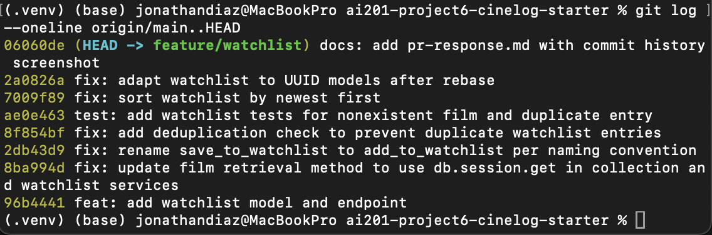

# PR Response Doc — CineLog Watchlist Feature

## AI Usage
I used an AI coding assistant during this project. I wrote the deduplication logic and the `AlreadyInWatchlistError` exception myself (Comment 2). I used AI for orientation — summarizing `models.py`, the collection service, and the test files before I read the review comments — and for mechanical work: performing the rename and updating call sites, scaffolding `tests/test_watchlist.py` following the existing test pattern, resolving the `.gitignore` conflict, adapting the model and tests to the UUID schema after the rebase, and rewording a commit message to conventional format. I reviewed each change and ran the test suite to confirm correctness. The design arguments in Comment 4 (default visibility) and Comment 5 (sort order) are my own reasoning — I did not have AI write those.

## Comment 1 — Rename
**What I did:** I renamed `save_to_watchlist()` to `add_to_watchlist()` in `services/watchlist_service.py` to match the project’s `verb_to_noun` naming convention used by `add_to_collection()`, and I updated the related import and call site in `routes/watchlist/watchlist.py`.
**How I verified:** I ran a project-wide search for `save_to_watchlist` and confirmed that all 3 occurrences across 2 files had been updated. I also ran `pytest tests/ -v`, and the existing test suite still passed.

## Comment 2 — Deduplication
**What I did:** I added a watchlist-specific duplicate check in `services/watchlist_service.py` so adding the same film twice now raises `AlreadyInWatchlistError` before a second entry is created.
**How I verified:** I verified this through the new test `test_add_to_watchlist_duplicate_raises`, which confirms that a second add raises `AlreadyInWatchlistError` and that only one entry remains in the database.

## Comment 3 — Missing test
**What I did:** I created `tests/test_watchlist.py` with a nonexistent-film test modeled on the collection test pattern and a duplicate-entry test to cover the new deduplication behavior.
**How I verified:** I ran `pytest tests/ -v` in the project virtual environment, and all 7 tests passed.

## Comment 4 — Default visibility
**My position:** Public-by-default is the right default for watchlists in CineLog.
**Reasoning:** In CineLog, a watchlist is more than a private record of past viewing; it is a signal of what a user is interested in and wants to explore next. Because the app is built around community-driven film discovery, that kind of interest data can support recommendations, social connection, and serendipitous discovery. A public watchlist makes it easier for others to find people with similar tastes, follow emerging interests, and discover films they might not otherwise encounter. I also think this information feels less sensitive than a completed collection because it reflects intent rather than a finished record of consumption, so making it visible by default fits the app’s social purpose.
**Tradeoff acknowledged:** The tradeoff is that public-by-default exposes a user’s interests and intentions more openly than a privacy-first approach would. Some users may not want their current viewing goals or niche tastes visible by default, especially while they are still exploring or experimenting. I am choosing the more social and discoverable behavior, even though it gives up some privacy and may require users to opt out if they want a more private experience.

## Comment 5 — Sort order
**My position:** I agree with the reviewer that the watchlist should be ordered by recency rather than alphabetically.
**Reasoning:** A watchlist is a live queue of films a user wants to engage with next, so the most relevant items are usually the ones they added most recently. Alphabetical sorting makes the list feel static and less useful for someone trying to pick up where they left off or see what has been added lately. Newest-first also makes the feature feel more responsive and current in a community-driven app like CineLog.
**Engagement with reviewer's point:** I think the reviewer’s point is strong because a watchlist is not a catalog; it is a working list. Showing the most recent additions first better reflects how users will actually interact with it, and it makes the list more actionable than a simple title-based ordering.

## Comment 6 — Rebase
**What conflicted:** During the rebase onto the refactored `main`, Git reported one merge conflict in `.gitignore` — both my branch and `main` had added a `.gitignore`, with slightly different rules. After the commits replayed, running the test suite also surfaced a logical incompatibility: my watchlist code still used integer film IDs, but `main`'s refactor had changed `Film.id` (and the collection `film_id`) to UUID strings.
**How I resolved it:** For `.gitignore`, I kept the union of both rule sets and continued the rebase. For the UUID mismatch, I changed `WatchlistEntry.film_id` from `db.Integer` to `db.String(36)` to match the new UUID `Film.id`, restored the `WatchlistEntry`–`Film` relationship, and updated the watchlist tests to use UUID-style film IDs. I committed this as a separate `fix: adapt watchlist to UUID models after rebase` commit.
**How I verified no conflict remains:** `git status` showed a clean tree with no conflict markers, `git log --oneline` confirmed a linear history with no merge commits, and `pytest tests/ -v` passed all 7 tests.

## PR Description
**What the feature does:** Adds a watchlist so users can save films they want to watch later. Includes the `WatchlistEntry` model, the `add_to_watchlist()` service function with duplicate protection, a `get_watchlist()` function that returns entries newest-first, and the REST endpoints.

**Design decisions:**
- *Default visibility:* Watchlist entries default to `public=True`. Reasoning is documented in Comment 4.
- *Sort order:* `get_watchlist()` returns entries by date added, newest first (Comment 5).

**How to manually test:**
1. Set up: `python -m venv .venv && source .venv/bin/activate && pip install -r requirements.txt`
2. Run the test suite: `pytest tests/ -v` (all 7 pass).
3. Or run the app (`python app.py`) and exercise the endpoints with curl: GET `/watchlist/<user_id>` to view the watchlist, then POST `/watchlist/<user_id>/add` with a JSON body like `{"film_id": "<film-id>"}` to add a film, and add the same film again to confirm the duplicate is rejected.

## Commit History

